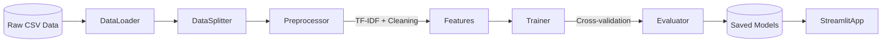

<p align="center">
  <h1 align="center">🏥 Clinical Trial Disease Classification</h1>
  <p align="center">
    <strong>Production-grade NLP pipeline for automatic disease category classification of clinical trial summaries</strong>
  </p>
  <p align="center">
    <a href="https://www.python.org/downloads/"></a>
    <a href="LICENSE"></a>
    <a href="#-results--performance"></a>
    <a href="#-launch-the-application"></a>
    <a href=".github/workflows/ci.yml"></a>
  </p>
</p>

<br/>

## 📖 Overview

Classifying clinical trials into disease categories is a critical bottleneck for medical researchers, trial coordinators, and healthcare data engineers who work with vast quantities of unstructured text from [ClinicalTrials.gov](https://clinicaltrials.gov/). Manual categorization is slow, error-prone, and does not scale.

This project delivers an **end-to-end Machine Learning solution** that automatically classifies clinical trial brief summaries into **8 distinct disease categories** — achieving an **F1 Macro score of 0.9436** using a LinearSVC model with TF-IDF features. The entire pipeline, from data ingestion through model evaluation, is wrapped in an interactive **Streamlit dashboard** for real-time and batch predictions.

### ⚡ Key Highlights

| | |
|---|---|
| 🎯 **94.36% F1 Macro** | Production-level accuracy across all 8 disease classes |
| 🧠 **5 ML Models Benchmarked** | Naive Bayes, Logistic Regression, Random Forest, LinearSVC, XGBoost |
| 🩺 **Medical-Aware NLP** | Custom preprocessing that expands abbreviations and preserves clinical negations |
| 📊 **60,337 Clinical Trials** | Trained on real ClinicalTrials.gov data |
| 🖥️ **Streamlit Dashboard** | Multi-page app with real-time predictions, batch inference, and data exploration |
| ⚙️ **Fully Automated Pipeline** | One command trains, evaluates, tunes, and exports all artifacts |

---

## 🏗️ Architecture

The project follows a **decoupled, object-oriented architecture** built on industry-standard design patterns (Strategy, Template, Singleton) for maximum extensibility and testability.



> **Design Patterns Used:**
> - **Strategy Pattern** — `BaseClassifier` abstraction guarantees all algorithms honor the same contract (`train`, `predict`, `evaluate`, `save`, `load`)
> - **Template / Pipeline Pattern** — `TextPreprocessor` applies a deterministic sequence of NLP transformations
> - **Singleton Pattern** — Centralized `Settings` (Pydantic) and `Logger` ensure consistency across the entire codebase

---

## ✨ Features

- **🩺 Medical-Aware Text Preprocessing** — Custom cleaning pipeline that expands abbreviations (`pt` → `patient`, `dx` → `diagnosis`) and explicitly preserves clinical negations (`no`, `not`, `denies`, `absent`)
- **🤖 Multiple ML Classifiers** — Benchmarks 5 algorithms: MultinomialNB, Logistic Regression, Random Forest, LinearSVC (with CalibratedClassifierCV), and XGBoost
- **⚖️ Class Imbalance Handling** — Employs stratified splits, balanced class weights, and F1 Macro optimization to ensure minority classes are classified fairly
- **🔧 Automated Hyperparameter Tuning** — `RandomizedSearchCV` on the top-2 performing models with F1 Macro scoring
- **🖥️ Production-Ready Streamlit App** — Multi-page dashboard with real-time single predictions, batch CSV inference, data exploration, EDA visualizations, and model performance analytics
- **📊 Auto-Generated Reports** — EDA reports, word clouds, confusion matrices, and model comparison charts generated automatically during training
- **🧪 Comprehensive Test Suite** — Pytest tests covering data loading, preprocessing, model training, splitting, and integration workflows
- **🔄 CI/CD Pipeline** — GitHub Actions workflow for automated linting (flake8), type checking (mypy), and testing (pytest) across Python 3.10–3.12

---

## 🚀 Quick Start

### Prerequisites

- Python 3.9 or higher
- pip package manager

### 1. Clone & Setup Environment

```bash
git clone https://github.com/sivadst/Clinical-Trial-Disease-Classification.git
cd Clinical-Trial-Disease-Classification
python -m venv .venv
source .venv/bin/activate        # On macOS/Linux
# .venv\Scripts\activate         # On Windows
pip install -r requirements.txt
```

### 2. Prepare the Data

Download `clinical_trials_raw_patient2trial_conditions.csv` from [ClinicalTrials.gov](https://clinicaltrials.gov/) and place it in the `data/` directory.

### 3. Train the Pipeline

```bash
python scripts/train.py
```

This single command executes the entire pipeline:
1. Loads and validates the raw dataset
2. Splits data with stratification (70% train / 10% val / 20% test)
3. Applies the full NLP preprocessing pipeline
4. Trains all 5 classifiers with cross-validation
5. Runs hyperparameter tuning on the top-2 models
6. Evaluates on the held-out test set
7. Exports all artifacts to `models/`:

| Artifact | Description |
|---|---|
| `best_model.pkl` | Serialized best-performing model |
| `tfidf_vectorizer.pkl` | Fitted TF-IDF vectorizer |
| `label_encoder.pkl` | Fitted label encoder |
| `metrics.json` | Per-model evaluation metrics |
| `classification_report.txt` | Full sklearn classification report |

> **Note:** You must run `python scripts/train.py` before launching the Streamlit app. The `.pkl` artifacts are gitignored and must be generated locally.

### 4. Launch the Application

```bash
streamlit run src/app/streamlit_app.py
```

---

## 📊 Dataset

| Property | Value |
|---|---|
| **Source** | [ClinicalTrials.gov](https://clinicaltrials.gov/) |
| **Total Samples** | 60,337 |
| **Target Variable** | `source_condition_query` (8 disease categories) |
| **Text Feature** | `brief_summary` (avg. ~688 characters) |
| **Imbalance Ratio** | 14.31× (max class / min class) |

---

## 🔬 Methodology

1. **Data Splitting** — Stratified 70/10/20 (Train / Validation / Test) to maintain class proportions across all splits
2. **Text Feature Extraction** — TF-IDF Vectorizer with unigrams + bigrams, capped at 10,000 features, `min_df=2`, `max_df=0.95`
3. **Model Training** — All 5 classifiers trained with balanced class weights where applicable
4. **Hyperparameter Optimization** — `RandomizedSearchCV` on the top-2 cross-validated models, optimizing F1 Macro
5. **Evaluation** — F1 Macro as the primary metric to penalize majority-class bias and ensure equitable performance across all disease categories

---

## 📈 Results & Performance

The primary evaluation metric is **F1 Macro**, which treats every disease class with equal importance regardless of frequency. The best-performing model was **LinearSVC**, achieving:

| Model | Accuracy | F1 Macro |
|:---|:---:|:---:|
| **LinearSVC** | **0.9519** | **0.9436** |
| XGBoost | 0.9490 | 0.9414 |
| Logistic Regression | 0.9471 | 0.9391 |
| Random Forest | 0.9432 | 0.9365 |
| Multinomial NB | 0.9059 | 0.8934 |

> All models achieve >89% F1 Macro, demonstrating that TF-IDF with classical ML provides strong baseline performance for clinical text classification without the computational overhead of deep learning approaches.

---

## 📁 Project Structure

```
Clinical-Trial-Disease-Classification/
│
├── config/                      # Centralized configuration (Pydantic BaseSettings)
│   ├── __init__.py
│   └── settings.py              # All paths, model params, TF-IDF config, classifier list
│
├── src/                         # Core source code
│   ├── app/
│   │   └── streamlit_app.py     # Multi-page Streamlit dashboard
│   ├── data/
│   │   ├── loader.py            # DataLoader with validation and null checks
│   │   ├── preprocessor.py      # TF-IDF + medical NLP preprocessing
│   │   └── splitter.py          # Stratified train/val/test splitting
│   ├── features/                # Feature engineering (extensible)
│   ├── models/
│   │   ├── base_model.py        # Abstract BaseClassifier (Strategy pattern)
│   │   ├── classifiers.py       # SklearnClassifierWrapper + ModelFactory
│   │   ├── trainer.py           # ModelTrainer with CV and hyperparameter search
│   │   └── evaluator.py         # ModelEvaluator with plotting
│   ├── utils/
│   │   ├── logger.py            # Centralized logging utility
│   │   └── exceptions.py        # Custom exception hierarchy
│   └── visualization/
│       └── eda_plots.py         # EDA visualization functions
│
├── scripts/                     # Execution entry points
│   ├── train.py                 # Full training pipeline
│   └── run_app.py               # Streamlit launcher
│
├── tests/                       # Pytest test suite
│   ├── test_data_loader.py      # Data loading and validation tests
│   ├── test_preprocessor.py     # NLP preprocessing tests
│   ├── test_splitter.py         # Data splitting tests
│   ├── test_models.py           # Model training and prediction tests
│   ├── test_integration.py      # End-to-end integration tests
│   └── test_app.py              # Streamlit application tests
│
├── notebooks/                   # Jupyter notebooks for exploration
│   ├── 01_eda.ipynb             # Exploratory Data Analysis
│   ├── 02_feature_engineering.ipynb
│   └── 03_model_comparison.ipynb
│
├── data/                        # Dataset directory (gitignored, except structure)
├── models/                      # Trained model artifacts (gitignored .pkl files)
├── reports/                     # Auto-generated reports and figures
│   ├── eda_report.md
│   ├── model_report.md
│   └── figures/                 # Confusion matrices, word clouds, charts
├── logs/                        # Application logs
│
├── .github/workflows/ci.yml     # GitHub Actions CI pipeline
├── pyproject.toml               # Build system and tool configuration
├── requirements.txt             # Production dependencies
├── requirements-dev.txt         # Development dependencies
├── ARCHITECTURE.md              # Architecture Decision Record (ADR)
├── LICENSE                      # MIT License
└── README.md                    # This file
```

---

## 🤝 Contributing

Contributions are welcome! To maintain code quality, please ensure all changes pass the following checks before submitting a pull request:

```bash
# Format code
black src/ tests/ --line-length 100

# Lint
flake8 src/ tests/

# Type check
mypy src/

# Run tests
pytest --cov=src --cov-report=term-missing
```

---

## 🔮 Future Roadmap

- 🧬 **Dense Embeddings** — Replace TF-IDF with domain-specific embeddings (BioBERT, ClinicalBERT) for richer semantic understanding
- 📊 **Advanced Imbalance Techniques** — Explore SMOTE, ADASYN, or synthetic data augmentation
- 🌐 **REST API** — Expose predictions via FastAPI for headless integration
- 🐳 **Containerization** — Docker support for fully reproducible environments
- 🏷️ **Multi-Label Classification** — Support trials covering multiple conditions simultaneously

---

## 🛠️ Tech Stack

| Component | Technology |
|---|---|
| **Language** | Python 3.9+ |
| **Data Processing** | Pandas, NumPy |
| **NLP** | NLTK, scikit-learn TF-IDF |
| **Machine Learning** | scikit-learn, XGBoost |
| **Visualization** | Matplotlib, Seaborn, WordCloud |
| **Web Application** | Streamlit |
| **Configuration** | Pydantic Settings |
| **Testing** | Pytest, pytest-cov |
| **CI/CD** | GitHub Actions |
| **Code Quality** | Black, Flake8, Mypy |

---

## 📄 License

This project is licensed under the **MIT License** — see the [LICENSE](LICENSE) file for details.

---

<p align="center">
  <sub>Built with ❤️ for the clinical research community</sub>
</p>
