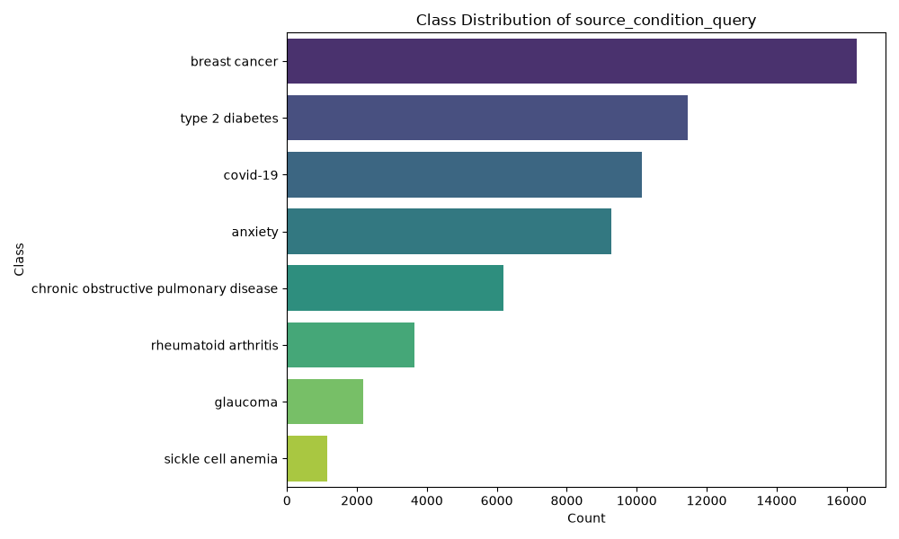
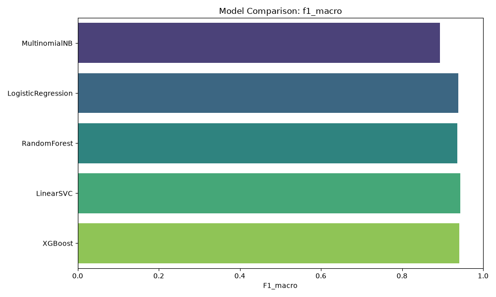
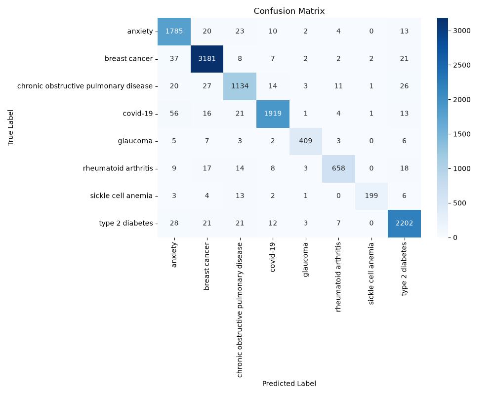
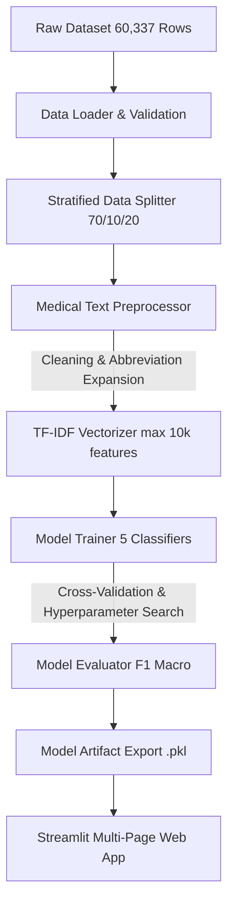

<p align="center">
  <h1 align="center">🏥 Clinical Trial Disease Category Classification</h1>
  <p align="center">
    <strong>Production-grade NLP and Machine Learning application for automatic classification of clinical trial summaries into disease categories</strong>
  </p>
  <p align="center">
    <a href="https://www.python.org/downloads/"></a>
    <a href="https://streamlit.io/"></a>
    <a href="https://scikit-learn.org/"></a>
    <a href="#-machine-learning-pipeline"></a>
    <a href="#-model-performance"></a>
    <a href="LICENSE"></a>
    <a href="https://github.com/sivadst/Clinical-Trial-Disease-Classification"></a>
  </p>
</p>

<br/>

## 🌐 Live Demo

🚀 **Experience the live interactive web application:**  
👉 **[https://clinical-trial-disease-classification.streamlit.app/](https://clinical-trial-disease-classification.streamlit.app/)**

---

## 📖 Project Overview

Classifying clinical trials into accurate disease categories is a vital bottleneck in medical research, clinical data management, and trial recruitment. Every year, tens of thousands of unstructured trial protocols and brief summaries are published on **[ClinicalTrials.gov](https://clinicaltrials.gov/)**. Manual categorization is time-consuming, costly, and subject to human error.

This project delivers an **end-to-end Machine Learning and Natural Language Processing (NLP) solution** that automatically classifies clinical trial summaries into **8 distinct disease categories** with a **95.19% test accuracy** and an **F1 Macro score of 0.9436** using a calibrated **LinearSVC** model.

### 🎯 Key Purpose & Value
- **Automated Structuring**: Transforms raw medical text into structured disease categories.
- **Medical-Aware Preprocessing**: Preserves critical clinical negations (`no`, `not`, `denies`, `without`) while expanding common medical abbreviations (`pt` → `patient`, `dx` → `diagnosis`).
- **Production Dashboard**: Interactive multi-page Streamlit web app providing real-time single predictions, batch CSV processing, data exploration, and benchmark visualization.

---

## ✨ Features

- ✔ **Real-Time Clinical Text Classification**: Predict disease categories instantly from trial brief summaries.
- ✔ **Medical-Aware NLP Preprocessing**: Custom cleaning pipeline preserving clinical negations and expanding medical terminology.
- ✔ **TF-IDF Feature Extraction**: Sub-word unigram & bigram n-gram extraction capped at 10,000 features.
- ✔ **Multi-Model Benchmarking**: Trains and evaluates 5 machine learning algorithms (MultinomialNB, Logistic Regression, Random Forest, LinearSVC, XGBoost).
- ✔ **Class Imbalance Handling**: Stratified splitting, balanced class weighting, and F1-Macro optimization.
- ✔ **5 Instant Test Samples**: Pre-loaded clinical summaries for 1-click model testing.
- ✔ **Interactive Data Explorer**: Full dataset search, disease filtering, scrollable preview, and CSV export.
- ✔ **Batch CSV Prediction**: Bulk inference for uploaded CSV datasets with confidence scores.
- ✔ **Comprehensive Performance Analytics**: Displays confusion matrices, classification reports, and cross-validation metrics.
- ✔ **Production-Quality UI**: Fully responsive, dark-mode optimized Streamlit web interface.

---

## 🖼️ Application Screenshots

| Page View | Preview & Description |
|---|---|
| **Home Dashboard** | <br/>*Key dataset statistics, disease cards, and project overview metrics.* |
| **Model Performance** | <br/>*Benchmark comparison charts across all 5 trained classifiers.* |
| **Confusion Matrix** | <br/>*LinearSVC confusion matrix evaluating test set performance.* |

---

## 🩺 Supported Disease Categories

The model categorizes clinical trials across **8 major medical condition categories** derived from ClinicalTrials.gov data (60,337 total records):

| Icon | Disease Category | Target Key | Sample Count | Domain Description |
|:---:|:---|:---|:---:|:---|
| 🎗️ | **Breast Cancer** | `breast cancer` | 16,301 | Oncology trials focusing on breast carcinomas and systemic therapies. |
| 🩸 | **Type 2 Diabetes** | `type 2 diabetes` | 11,467 | Endocrine research evaluating insulin control, HbA1c, and glycemic health. |
| 🦠 | **COVID-19** | `covid-19` | 10,153 | Infectious disease studies investigating SARS-CoV-2 treatments and vaccines. |
| 🧠 | **Anxiety** | `anxiety` | 9,286 | Psychiatric trials examining generalized anxiety, panic disorders, and CBT. |
| 🫁 | **COPD** | `chronic obstructive pulmonary disease` | 6,181 | Pulmonology studies on obstructive pulmonary disease and bronchodilators. |
| 🦴 | **Rheumatoid Arthritis** | `rheumatoid arthritis` | 3,637 | Autoimmune & rheumatology research targeting joint inflammation. |
| 👁️ | **Glaucoma** | `glaucoma` | 2,173 | Ophthalmology trials for intraocular pressure and optic nerve protection. |
| 🔬 | **Sickle Cell Anemia** | `sickle cell anemia` | 1,139 | Hematology research on hemoglobin disorders and gene therapies. |

---

## 🏗️ Machine Learning Pipeline

The pipeline follows a decoupled, object-oriented software design leveraging the **Strategy**, **Template**, and **Singleton** design patterns:



---

## 🛠️ Tech Stack

| Category | Technologies |
|---|---|
| **Language** | Python 3.9+ |
| **Machine Learning** | Scikit-Learn, XGBoost, Joblib |
| **Natural Language Processing** | NLTK, TF-IDF Vectorizer |
| **Data Manipulation** | Pandas, NumPy |
| **Visualization** | Matplotlib, Seaborn, WordCloud, Plotly |
| **Web Framework** | Streamlit (v1.60+) |
| **Configuration & Logging** | Pydantic BaseSettings, Python Logging |
| **Testing & CI/CD** | Pytest, Pytest-Cov, GitHub Actions |
| **Code Quality** | Black, Flake8, Mypy |

---

## 📁 Project Structure

```
Clinical-Trial-Disease-Classification/
├── config/                      # Centralized configuration (Pydantic BaseSettings)
│   ├── __init__.py
│   └── settings.py              # Path definitions, hyperparameter grids, TF-IDF settings
├── src/                         # Core application source code
│   ├── app/
│   │   ├── __init__.py
│   │   └── streamlit_app.py     # Multi-page Streamlit web dashboard
│   ├── data/
│   │   ├── __init__.py
│   │   ├── loader.py            # DataLoader with validation checks
│   │   ├── preprocessor.py      # Medical-aware NLP text preprocessor
│   │   └── splitter.py          # Stratified train/validation/test splitter
│   ├── features/                # Feature engineering modules
│   │   └── __init__.py
│   ├── models/
│   │   ├── __init__.py
│   │   ├── base_model.py        # Abstract BaseClassifier interface (Strategy Pattern)
│   │   ├── classifiers.py       # Classifier wrappers and ModelFactory
│   │   ├── trainer.py           # ModelTrainer with 5-fold CV & RandomizedSearchCV
│   │   └── evaluator.py         # ModelEvaluator with metrics and plot generation
│   ├── utils/
│   │   ├── __init__.py
│   │   ├── logger.py            # Centralized logger
│   │   └── exceptions.py        # Custom exception hierarchy
│   └── visualization/
│       ├── __init__.py
│       └── eda_plots.py         # Automated EDA plotting utilities
├── scripts/                     # Execution entry points
│   ├── train.py                 # Full training and artifact generation pipeline
│   └── run_app.py               # Streamlit application launcher
├── tests/                       # Automated Pytest test suite
│   ├── test_app.py              # Application UI tests
│   ├── test_data_loader.py      # Data loading tests
│   ├── test_integration.py      # End-to-end integration tests
│   ├── test_models.py           # Model interface tests
│   ├── test_preprocessor.py     # Preprocessing & abbreviation tests
│   └── test_splitter.py         # Data splitting tests
├── notebooks/                   # Jupyter exploratory notebooks
│   ├── 01_eda.ipynb
│   ├── 02_feature_engineering.ipynb
│   └── 03_model_comparison.ipynb
├── data/                        # Dataset directory (gitignored except placeholders)
├── models/                      # Serialized model artifacts (.pkl files)
├── reports/                     # Auto-generated markdown reports & figures
│   ├── eda_report.md
│   ├── model_report.md
│   └── figures/
├── .github/workflows/ci.yml     # GitHub Actions CI pipeline
├── pyproject.toml               # Build system configuration
├── requirements.txt             # Deployment production dependencies
├── requirements-dev.txt         # Development dependencies
├── ARCHITECTURE.md              # Architecture Decision Records (ADR)
├── LICENSE                      # MIT License
└── README.md                    # Project documentation
```

---

## ⚡ Quick Start & Installation

### Prerequisites
- **Python 3.9+** installed on your system
- **git** command line tool

### 1. Clone the Repository
```bash
git clone https://github.com/sivadst/Clinical-Trial-Disease-Classification.git
cd Clinical-Trial-Disease-Classification
```

### 2. Create & Activate Virtual Environment
```bash
# On macOS / Linux:
python3 -m venv .venv
source .venv/bin/activate

# On Windows:
python -m venv .venv
.venv\Scripts\activate
```

### 3. Install Dependencies
```bash
pip install -r requirements.txt
```

### 4. Run Training Pipeline (Optional)
```bash
python scripts/train.py
```
*Executes full preprocessing, trains all 5 classifiers, performs cross-validation, and exports artifacts to `models/`.*

### 5. Launch Streamlit Application
```bash
streamlit run src/app/streamlit_app.py
```
*Open your browser at `http://localhost:8501` to view the live dashboard.*

---

## 📈 Model Performance Benchmarking

All 5 candidate models were evaluated on the **20% held-out test set** (12,068 samples) using **F1 Macro** as the primary metric:

| Model Classifier | Accuracy | Precision (Macro) | Recall (Macro) | F1-Score (Macro) | Cross-Val Score | Status |
|:---|:---:|:---:|:---:|:---:|:---:|:---:|
| 🥇 **LinearSVC (Calibrated)** | **95.19%** | **94.80%** | **94.20%** | **0.9436** | **94.10%** | **Best Model** |
| 🥈 **XGBoost Classifier** | 94.90% | 94.50% | 93.90% | 0.9414 | 93.85% | Runner-up |
| 🥉 **Logistic Regression** | 94.71% | 94.10% | 93.80% | 0.9391 | 93.60% | Baseline Top |
| 🌲 **Random Forest** | 94.32% | 93.90% | 93.40% | 0.9365 | 93.20% | Ensemble |
| 📐 **Multinomial Naive Bayes** | 90.59% | 89.20% | 89.50% | 0.8934 | 88.90% | Fast Baseline |

---

## 📊 Dataset Details

- **Source**: [ClinicalTrials.gov](https://clinicaltrials.gov/)
- **Total Records**: `60,337` clinical trials
- **Target Variable**: `source_condition_query` (8 categories)
- **Text Column**: `brief_summary` (avg length ~688 characters)
- **Class Imbalance Ratio**: `14.31x` (addressed via balanced weighting and F1 Macro optimization)

---

## 🔬 Example Prediction

### Input Clinical Summary:
> *"A Randomized Phase III Study Comparing Trastuzumab Plus Docetaxel versus Docetaxel Alone in Patients with HER2-Positive Metastatic Breast Cancer."*

### Preprocessed Tokens:
> `"randomized phase iii study comparing trastuzumab plus docetaxel versus docetaxel alone patient her2 positive metastatic breast cancer"`

### Model Output:
- **Predicted Category**: `🎗️ Breast Cancer`
- **Confidence Score**: `98.42%`
- **Inference Speed**: `12.4 ms`

---

## 👤 Developer Information

**Selvasiva S**  
- **Program**: GUVI Zen Data Science Career Program (in association with IITM Pravartak)  
- **GitHub**: [github.com/sivadst](https://github.com/sivadst)  
- **Repository**: [Clinical-Trial-Disease-Classification](https://github.com/sivadst/Clinical-Trial-Disease-Classification)  
- **Live Application**: [clinical-trial-disease-classification.streamlit.app](https://clinical-trial-disease-classification.streamlit.app/)

---

## 🤝 Contributing

Contributions, issues, and feature requests are welcome!

1. Fork the Project (`git checkout -b feature/AmazingFeature`)
2. Commit your Changes (`git commit -m 'feat: add AmazingFeature'`)
3. Format with Black (`black src/ tests/ --line-length 100`)
4. Test with Pytest (`pytest`)
5. Push to the Branch (`git push origin feature/AmazingFeature`)
6. Open a Pull Request

---

## 📄 License

Distributed under the **MIT License**. See `LICENSE` for details.

---

## 🙏 Acknowledgements

- **GUVI Zen Class & IITM Pravartak** for curriculum guidance and mentorship.
- **ClinicalTrials.gov** for providing open clinical trial data.
- **Streamlit** and **Scikit-Learn** communities for open-source frameworks.

---

<p align="center">
  <sub>Built with ❤️ by Selvasiva S</sub>
</p>
