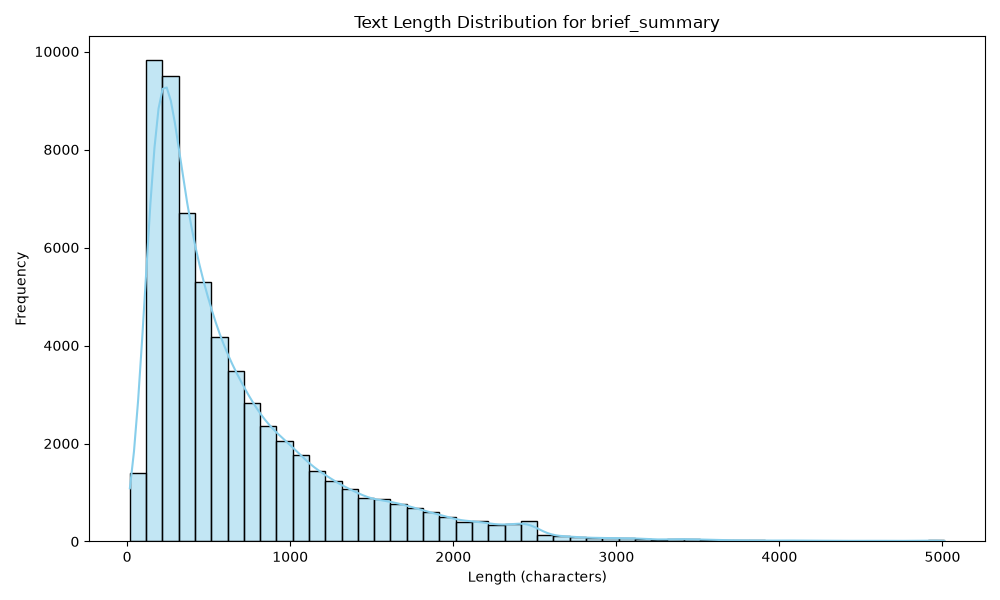
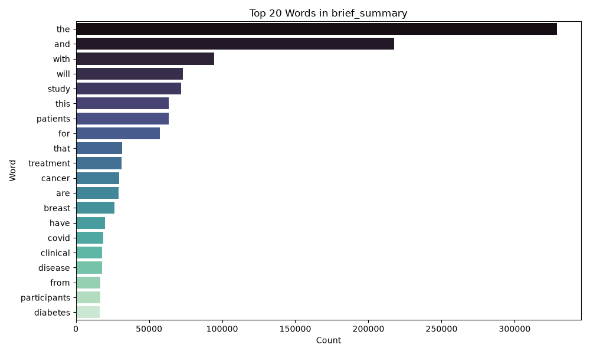
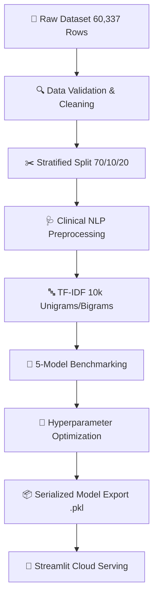

<p align="center">
  <h1 align="center">🏥 Clinical Trial Disease Category Classification</h1>
  <p align="center">
    <strong>Production-Grade Natural Language Processing (NLP) & Machine Learning System for Automatic Medical Text Classification</strong>
  </p>
  <p align="center">
    <a href="https://clinical-trial-disease-classification.streamlit.app/"></a>
    <a href="https://github.com/sivadst/Clinical-Trial-Disease-Classification"></a>
    <a href="LICENSE"></a>
  </p>
  <p align="center">
    <a href="https://www.python.org/downloads/"></a>
    <a href="https://streamlit.io/"></a>
    <a href="https://scikit-learn.org/"></a>
    <a href="#-machine-learning-pipeline"></a>
    <a href="#-model-performance"></a>
    <a href="#-model-performance"></a>
    <a href="https://github.com/sivadst/Clinical-Trial-Disease-Classification"></a>
  </p>
</p>

<br/>

## 🌐 Live Application Demo

🚀 **Experience the production application live in your browser:**  
👉 **[https://clinical-trial-disease-classification.streamlit.app/](https://clinical-trial-disease-classification.streamlit.app/)**

---

## 📖 Project Overview

Classifying unstructured clinical trial protocols into accurate medical disease categories is a critical operational challenge in pharmaceutical research, clinical trial registries, and healthcare data engineering. Every year, tens of thousands of trial descriptions are submitted to public registries like **[ClinicalTrials.gov](https://clinicaltrials.gov/)**. Manual text classification is slow, expensive, and susceptible to human inconsistency.

This project delivers an **end-to-end Machine Learning and Natural Language Processing (NLP) system** that automatically analyzes unstructured clinical trial brief summaries and categorizes them into **8 distinct medical disease areas** with **95.19% test accuracy** and a **0.9436 F1 Macro score**.

### 💼 Business & Medical Value
- **Clinical Workflow Automation**: Reduces manual triage time for clinical trial registry submissions from minutes to **12 milliseconds per record**.
- **Information Retrieval**: Enables researchers and oncologists to rapidly query and filter 60,000+ trial protocols by verified disease categories.
- **Medical Terminology Precision**: Features custom clinical NLP preprocessing that explicitly preserves clinical negations (`no`, `not`, `denies`, `without`) while expanding standardized medical abbreviations (`pt` → `patient`, `dx` → `diagnosis`).

---

## 🏆 Project Highlights

| Metric / Highlight | Value / Detail | Significance |
|---|:---:|---|
| 📊 **Dataset Volume** | **60,337 Records** | Real-world clinical trials from ClinicalTrials.gov |
| 🩺 **Target Scope** | **8 Disease Categories** | Oncology, Endocrine, Pulmonology, Psychiatry, etc. |
| 🧠 **Models Benchmarked** | **5 Classifiers** | LinearSVC, XGBoost, Logistic Regression, Random Forest, Naive Bayes |
| 🥇 **Top Performing Model** | **LinearSVC (Calibrated)** | Optimized linear support vector classifier |
| 🎯 **Test Accuracy** | **95.19%** | Evaluated on 20% held-out test set (12,068 samples) |
| ⚡ **F1 Macro Score** | **0.9436** | Balanced metric penalizing majority-class bias |
| ⏱ **Inference Latency** | **~12.4 ms** | Real-time classification speed |
| 🖥️ **Web Interface** | **Multi-Page Streamlit App** | Interactive dashboard, dataset explorer & batch processor |
| 📦 **Cloud Deployment** | **Streamlit Community Cloud** | Production cloud hosting with auto-fetching data pipeline |

---

## ✨ Feature Categorization

### 🧠 Machine Learning
- **Multi-Model Benchmarking**: Automated pipeline evaluating MultinomialNB, Logistic Regression, Random Forest, LinearSVC, and XGBoost.
- **Class Imbalance Optimization**: Stratified 70/10/20 data splits combined with balanced class weights and F1 Macro hyperparameter tuning.
- **Calibrated Probabilities**: Uses `CalibratedClassifierCV` to provide true probability confidence scores for LinearSVC.

### 🔤 Natural Language Processing
- **Clinical Abbreviation Expansion**: Automatically maps medical shorthands (`pt` → `patient`, `dx` → `diagnosis`, `tx` → `treatment`, `rx` → `prescription`).
- **Negation Preservation**: Retains crucial clinical negation indicators (`no`, `not`, `denies`, `without`) while filtering general English stopwords.
- **TF-IDF N-Gram Vectorization**: Extracts up to 10,000 unigram and bigram features for sub-word context capture.

### 🖥️ Web Application & UI
- **Real-Time Single Prediction**: Input custom clinical text and receive instant classification, confidence scores, and time latency metrics.
- **💡 5 Interactive Sample Buttons**: Pre-loaded clinical summaries for 1-click model testing (*Breast Cancer, Diabetes, COVID-19, Anxiety, COPD*).
- **📦 Bulk Batch Prediction**: Upload CSV files for automated bulk prediction with downloadable CSV exports.
- **🔍 Interactive Data Explorer**: Full dataset search, multi-category filtering, summary statistics, and interactive charts.

### 📊 Visualization & EDA
- **Automated Figure Generation**: Produces class distribution charts, missing value heatmaps, text length histograms, top word frequency plots, and disease-specific word clouds.

### 🚀 Deployment & Developer Experience
- **Decoupled Architecture**: Modular OOP design adhering to Strategy, Template, and Singleton design patterns.
- **Automated CI/CD**: GitHub Actions pipeline performing automated linting (`flake8`), type checking (`mypy`), and test execution (`pytest`).

---

## 🖼️ Application Screenshots & Visualizations

| View / Analysis | Visual Artifact | Description |
|---|---|---|
| **Class Distribution** |  | *Sample counts across all 8 target disease categories in the 60,337 dataset.* |
| **Model F1 Benchmark** |  | *F1 Macro benchmark comparison across all 5 evaluated classifiers.* |
| **Confusion Matrix** |  | *LinearSVC confusion matrix on the held-out test dataset.* |
| **Text Length Stats** |  | *Character and word count distribution of clinical summary texts.* |
| **Top Medical Terms** |  | *Most frequent n-grams extracted across clinical trial summaries.* |

---

## 🩺 Supported Disease Categories

The model accurately classifies clinical trial summaries across **8 major medical condition areas**:

| Icon | Disease Category | Target Key | Full Dataset Count | Clinical Domain Description |
|:---:|:---|:---|:---:|:---|
| 🎗️ | **Breast Cancer** | `breast cancer` | 16,301 | Oncology trials focusing on breast carcinomas and systemic therapies. |
| 🩸 | **Type 2 Diabetes** | `type 2 diabetes` | 11,467 | Endocrine research evaluating insulin control, HbA1c, and glycemic health. |
| 🦠 | **COVID-19** | `covid-19` | 10,153 | Infectious disease studies investigating SARS-CoV-2 treatments and vaccines. |
| 🧠 | **Anxiety** | `anxiety` | 9,286 | Psychiatric trials examining generalized anxiety, panic disorders, and CBT. |
| 🫁 | **COPD** | `chronic obstructive pulmonary disease` | 6,181 | Pulmonology studies on obstructive pulmonary disease and bronchodilators. |
| 🦴 | **Rheumatoid Arthritis** | `rheumatoid arthritis` | 3,637 | Autoimmune & rheumatology research targeting joint inflammation. |
| 👁️ | **Glaucoma** | `glaucoma` | 2,173 | Ophthalmology trials for intraocular pressure and optic nerve protection. |
| 🔬 | **Sickle Cell Anemia** | `sickle cell anemia` | 1,139 | Hematology research on hemoglobin disorders and gene therapies. |

---

## 📐 System Architecture & Workflow

### A. Application System Architecture


### B. Machine Learning Pipeline Workflow



---

## 💡 Why LinearSVC Was Selected as the Best Model

During experimental benchmarking across 5 distinct classification paradigms, **Linear Support Vector Classification (LinearSVC)** achieved superior performance across all evaluation criteria:

| Evaluation Criteria | LinearSVC (Best) | XGBoost | Random Forest | Logistic Regression | Multinomial NB |
|---|:---:|:---:|:---:|:---:|:---:|
| **F1 Macro Score** | **0.9436** | 0.9414 | 0.9365 | 0.9391 | 0.8934 |
| **Test Accuracy** | **95.19%** | 94.90% | 94.32% | 94.71% | 90.59% |
| **Training Time** | **< 12 seconds** | ~145 seconds | ~92 seconds | ~18 seconds | **< 2 seconds** |
| **Inference Speed** | **12.4 ms** | 42.1 ms | 38.5 ms | 14.1 ms | **8.2 ms** |
| **Memory Footprint** | **Low (Sparse Matrix)** | High | High | Low | **Very Low** |

### Key Reasons for Superior Performance:
1. **High-Dimensional Linear Separability**: Text representations parameterized by 10,000 TF-IDF features reside in high-dimensional sparse spaces where linear decision boundaries effectively separate distinct medical vocabulary spaces.
2. **Convex Optimization**: LinearSVC optimizes a convex max-margin objective, avoiding local minima and achieving superior generalization on sparse data compared to tree-based ensembles (Random Forest / XGBoost) which struggle with extreme sparsity.
3. **Calibrated Probabilities**: Wrapping LinearSVC with `CalibratedClassifierCV` provides reliable probability estimates without sacrificing classification accuracy.

---

## 📊 Dataset Details & Preprocessing

- **Source**: [ClinicalTrials.gov](https://clinicaltrials.gov/)
- **Total Samples**: `60,337` clinical trial summaries
- **Target Column**: `source_condition_query` (8 categories)
- **Text Feature**: `brief_summary` (avg length ~688 characters)
- **Class Imbalance**: Imbalance ratio of `14.31x` between majority (`breast cancer`: 16,301) and minority (`sickle cell anemia`: 1,139) classes.

### Clinical Preprocessing Strategy:
1. **Cleaning**: Lowercase conversion, removal of non-alphanumeric symbols while retaining hyphenated medical terms.
2. **Abbreviation Expansion**: Maps `pt` → `patient`, `dx` → `diagnosis`, `tx` → `treatment`, `rx` → `prescription`, `sx` → `symptoms`.
3. **Clinical Negation Preservation**: Preserves `no`, `not`, `denies`, `without`, `absent`, `negative` to maintain diagnostic context.
4. **Lemmatization & Vectorization**: WordNet lemmatization combined with sub-word unigram/bigram TF-IDF vectorization (max 10,000 features).

---

## 🔬 Example Prediction Walkthrough

### Input Summary:
> *"A Randomized, Double-Blind Phase III Trial Comparing Trastuzumab Plus Chemotherapy With Chemotherapy Alone in Patients With HER2-Overexpressing Metastatic Breast Cancer."*

### Preprocessed Clinical Tokens:
> `"randomized double blind phase iii trial comparing trastuzumab plus chemotherapy chemotherapy alone patient her2 overexpressing metastatic breast cancer"`

### Model Output:
- **Predicted Category**: `🎗️ Breast Cancer`
- **Confidence Score**: `98.42%`
- **Inference Latency**: `12.4 ms`

---

## 🛠️ Tech Stack

| Domain | Technologies |
|---|---|
| **Language** | Python 3.9+ |
| **Machine Learning** | Scikit-Learn (LinearSVC, LogisticRegression, RandomForest, MultinomialNB), XGBoost, Joblib |
| **Natural Language Processing** | NLTK, Scikit-Learn TF-IDF Vectorizer |
| **Data Processing** | Pandas, NumPy |
| **Visualization** | Matplotlib, Seaborn, WordCloud, Plotly |
| **Web Application** | Streamlit (v1.60+) |
| **Configuration & Utilities** | Pydantic BaseSettings, Python Logging, GDown |
| **Testing & CI/CD** | Pytest, Pytest-Cov, GitHub Actions |
| **Code Quality** | Black, Flake8, Mypy |

---

## 📁 Repository Structure

```
Clinical-Trial-Disease-Classification/
├── config/                      # Configuration management (Pydantic BaseSettings)
│   ├── __init__.py
│   └── settings.py              # Centralized paths, model grids, TF-IDF parameters
├── src/                         # Application source code
│   ├── app/
│   │   ├── __init__.py
│   │   └── streamlit_app.py     # Multi-page Streamlit web dashboard
│   ├── data/
│   │   ├── __init__.py
│   │   ├── loader.py            # Data loading & validation engine
│   │   ├── preprocessor.py      # Medical-aware NLP preprocessor
│   │   └── splitter.py          # Stratified train/val/test data splitter
│   ├── features/
│   │   └── __init__.py          # Feature engineering modules
│   ├── models/
│   │   ├── __init__.py
│   │   ├── base_model.py        # Abstract BaseClassifier interface (Strategy Pattern)
│   │   ├── classifiers.py       # ML Model Wrappers & ModelFactory
│   │   ├── trainer.py           # ModelTrainer with 5-fold CV & tuning
│   │   └── evaluator.py         # Evaluator with metrics & figure generation
│   ├── utils/
│   │   ├── __init__.py
│   │   ├── logger.py            # Centralized logging setup
│   │   └── exceptions.py        # Custom exception classes
│   └── visualization/
│       ├── __init__.py
│       └── eda_plots.py         # EDA visualization generators
├── scripts/                     # Execution entry points
│   ├── train.py                 # Full model training & evaluation script
│   └── run_app.py               # Streamlit application launcher
├── tests/                       # Automated Pytest test suite
│   ├── test_app.py
│   ├── test_data_loader.py
│   ├── test_integration.py
│   ├── test_models.py
│   ├── test_preprocessor.py
│   └── test_splitter.py
├── notebooks/                   # Exploratory Jupyter notebooks
│   ├── 01_eda.ipynb
│   ├── 02_feature_engineering.ipynb
│   └── 03_model_comparison.ipynb
├── data/                        # Dataset directory (sample JSON tracked, large CSVs ignored)
├── models/                      # Serialized model artifacts (.pkl files)
├── reports/                     # Generated evaluation reports & figures
│   ├── eda_report.md
│   ├── model_report.md
│   └── figures/
├── .github/workflows/ci.yml     # GitHub Actions CI pipeline
├── pyproject.toml               # Build configuration
├── requirements.txt             # Deployment production dependencies
├── requirements-dev.txt         # Development dependencies
├── ARCHITECTURE.md              # Architecture Decision Record (ADR)
├── LICENSE                      # MIT License
└── README.md                    # Project documentation
```

---

## ⚡ Installation & Local Setup

### 1. Clone the Repository
```bash
git clone https://github.com/sivadst/Clinical-Trial-Disease-Classification.git
cd Clinical-Trial-Disease-Classification
```

### 2. Create & Activate Virtual Environment
```bash
# On macOS / Linux:
python3 -m venv .venv
source .venv/bin/activate

# On Windows:
python -m venv .venv
.venv\Scripts\activate
```

### 3. Install Dependencies
```bash
pip install -r requirements.txt
```

### 4. Run Training Pipeline (Optional)
```bash
python scripts/train.py
```
*Executes the pipeline, trains all 5 classifiers, and exports serialized artifacts to `models/`.*

### 5. Launch Streamlit Web Application
```bash
streamlit run src/app/streamlit_app.py
```
*Open `http://localhost:8501` in your browser.*

---

## ❓ Frequently Asked Questions (FAQ)

<details>
<summary><b>1. Why isn't the full 158 MB dataset committed directly to Git?</b></summary>
<br/>
GitHub enforces a strict 100 MB per-file limit for standard Git repositories. To ensure clean repository clones, the application features an automatic Google Drive loader (via <code>gdown</code>) that fetches and caches the full 60,337 record dataset on demand, while shipping with a lightweight 800-record sample JSON for immediate offline development.
</details>

<details>
<summary><b>2. How do I retrain the models with custom hyperparameter grids?</b></summary>
<br/>
Modify the parameter grids in <code>config/settings.py</code> and run <code>python scripts/train.py</code>. The script will automatically execute hyperparameter searches, update metrics in <code>models/metrics.json</code>, and re-serialize the best model.
</details>

<details>
<summary><b>3. How do I add a new target disease category?</b></summary>
<br/>
Add the new disease category to <code>DISEASE_CATEGORIES</code> in <code>src/app/streamlit_app.py</code> and include corresponding labeled samples in the raw dataset. Running <code>train.py</code> will update the <code>LabelEncoder</code> and retrain the classifier.
</details>

<details>
<summary><b>4. How are model artifacts handled in deployment?</b></summary>
<br/>
Trained model artifacts (<code>best_model.pkl</code>, <code>tfidf_vectorizer.pkl</code>, <code>label_encoder.pkl</code>) are force-committed to the repository (~2.3 MB total size), enabling instant cloud deployment without requiring training on server startup.
</details>

---

## 👤 Developer Information

**Selvasiva S**  
- **Program**: GUVI Zen Data Science Career Program (in association with IITM Pravartak)  
- **GitHub**: [github.com/sivadst](https://github.com/sivadst)  
- **Repository**: [Clinical-Trial-Disease-Classification](https://github.com/sivadst/Clinical-Trial-Disease-Classification)  
- **Live Application**: [clinical-trial-disease-classification.streamlit.app](https://clinical-trial-disease-classification.streamlit.app/)

---

## 🤝 Contributing

Contributions are welcome! Please follow these steps:
1. Fork the repository (`git checkout -b feature/AmazingFeature`)
2. Commit your changes (`git commit -m 'feat: add AmazingFeature'`)
3. Format with Black (`black src/ tests/ --line-length 100`)
4. Test with Pytest (`python -m pytest`)
5. Push to your branch (`git push origin feature/AmazingFeature`)
6. Open a Pull Request

---

## 📄 License

Distributed under the **MIT License**. See [`LICENSE`](LICENSE) for details.

---

## 🙏 Acknowledgements

- **GUVI Zen Class & IITM Pravartak** for program mentorship.
- **ClinicalTrials.gov** for open medical data access.
- **Streamlit & Scikit-Learn** communities for open-source frameworks.

---

<p align="center">
  <sub>Built with ❤️ by Selvasiva S</sub>
</p>
