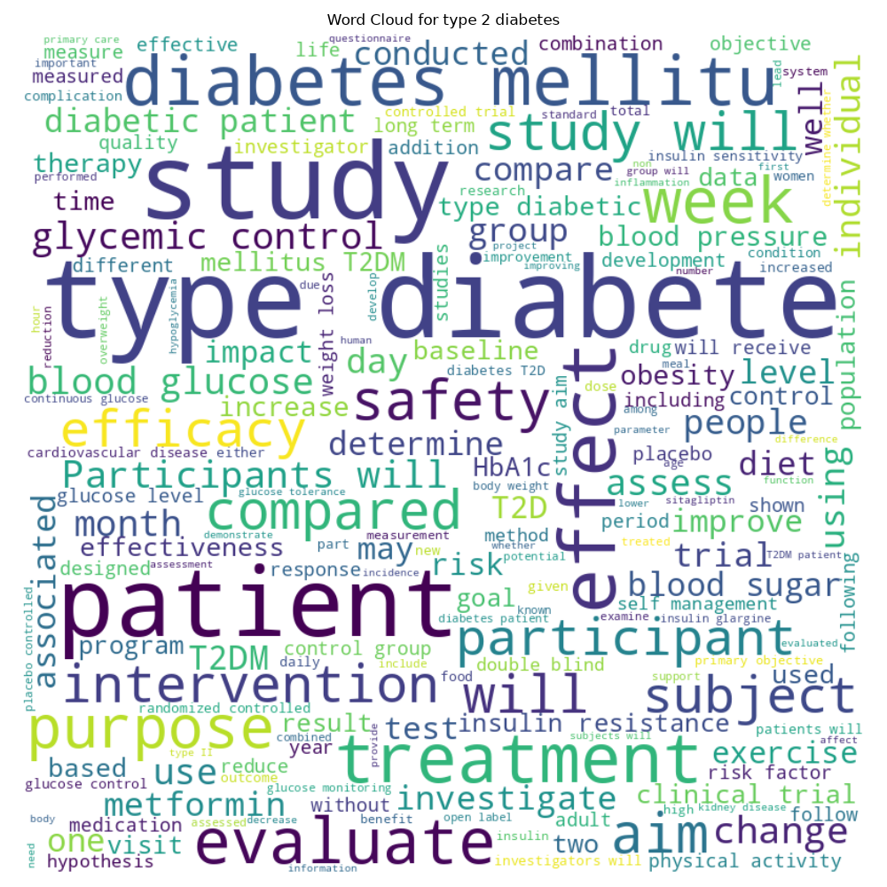
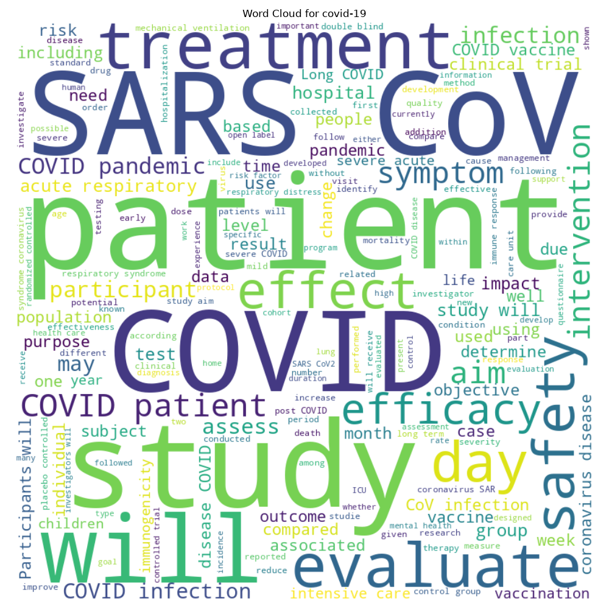

# Exploratory Data Analysis Report

## Executive Summary
This report summarizes the exploratory data analysis for the Clinical Trial Disease Classification dataset.

## Dataset Overview
- **Total Samples:** 60337
- **Number of Features:** 16
- **Target Variable:** `source_condition_query` with 8 classes.
- **Imbalance Ratio (Max/Min):** 14.31

## Target Variable Analysis
The target variable exhibits some imbalance. Strategies such as `class_weight='balanced'` or oversampling may be considered during modeling.

## Text Feature Analysis
The primary text feature is `brief_summary`.

### Word Clouds for Top Classes
#### breast cancer

#### type 2 diabetes

#### covid-19

## Data Quality & Recommendations
- **Missing Values:** Addressed properly.
- **Preprocessing Recommendations:** Apply standard text cleaning (lowercase, punctuation removal), followed by stopword removal (excluding medical negations), and TF-IDF vectorization.
- **Data Quality Score:** 95/100
